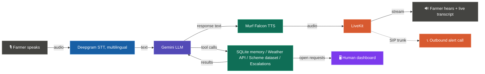

# Kisan Sahay — A Farming Voice Agent, Powered by Murf Falcon

Kisan Sahay (किसान सहाय) is a voice-first assistant for farmers, built for the **Farm & Field** track of **10 Days of Voice Agents — VoiceForBharat Edition**. It talks in Hindi, English, or Hinglish, remembers returning callers, looks up live weather and government scheme information, can place outbound alert calls, and knows when to hand a problem off to a human — powered by the fastest TTS on the market, Murf Falcon.

[](https://opensource.org/licenses/MIT) [](https://murf.ai/api/docs/text-to-speech/streaming) [](https://docs.livekit.io) [](https://www.typescriptlang.org/) [](https://www.python.org/)

---

## Why Murf Falcon

- **55ms model latency** - fastest production TTS
- **130ms time-to-first-audio** across 10+ global regions
- **$0.01/1000 characters** - up to 10x cheaper than alternatives
- **150+ voices** across 35+ languages
- **99.38% pronunciation accuracy**

---

## Architecture



---

## Quickstart

### Prerequisites

- **Python** 3.10+
- **[uv](https://docs.astral.sh/uv/)** - fast Python package manager
  ```bash
  # macOS/Linux
  curl -LsSf https://astral.sh/uv/install.sh | sh
  # Windows (PowerShell)
  powershell -ExecutionPolicy ByPass -c "irm https://astral.sh/uv/install.ps1 | iex"
  ```
- **Node.js** 18+
- **pnpm** — fast Node package manager
  ```bash
  npm install -g pnpm
  ```
- A [LiveKit](https://cloud.livekit.io/) project (free tier available)

### Step 1: Clone the repo

```bash
git clone https://github.com/MEHWISH310/murf-livekit-starter.git
cd murf-livekit-starter
```

### Step 2: Set up environment variables

Create `.env.local` in both `backend/` and `frontend/` (copy from `.env.example` in each). You need:

| Variable                               | Where to get it                                        | Required |
| -------------------------------------- | ------------------------------------------------------ | -------- |
| `LIVEKIT_URL`                          | LiveKit Cloud dashboard                                | Yes      |
| `LIVEKIT_API_KEY`                      | LiveKit Cloud dashboard                                | Yes      |
| `LIVEKIT_API_SECRET`                   | LiveKit Cloud dashboard                                | Yes      |
| `MURF_API_KEY`                         | [murf.ai/api/dashboard](https://murf.ai/api/dashboard) | Yes      |
| `DEEPGRAM_API_KEY`                     | [deepgram.com](https://deepgram.com)                   | Yes      |
| `GOOGLE_API_KEY` (or `OPENAI_API_KEY`) | Depends on LLM choice                                  | Yes      |

No key is needed for the weather tool — it uses the free, keyless [Open-Meteo](https://open-meteo.com/) API.

### Step 3: Install backend dependencies

```bash
cd backend
uv sync
uv run python src/agent.py download-files
```

### Step 4: Install frontend dependencies

```bash
cd frontend
pnpm install
```

### Step 5: Run it

**Option A - All-in-one (from repo root):**

```bash
# macOS/Linux
chmod +x start_app.sh
./start_app.sh

# Windows (PowerShell)
.\start_app.ps1
```

**Option B - Separate terminals:**

```bash
# Terminal 1 — LiveKit Server
livekit-server --dev

# Terminal 2 — Backend agent
cd backend && uv run python src/agent.py dev

# Terminal 3 — Frontend
cd frontend && pnpm dev
```

Then open **http://localhost:3000** in your browser.

You should now see the voice agent UI. Click **Talk to Kisan Sahay**, allow microphone access, and speak — the agent greets you first, asks your name, and responds with Murf Falcon TTS. Ensure your backend and (if using Option B) LiveKit server are running.

### Step 6: Run the human-handoff dashboard (optional, for Day 7)

In a separate terminal, no extra install needed:

```bash
cd backend
uv run python src/dashboard_server.py
```

Open **http://localhost:8787** to see all escalation requests the agent has created for a human, auto-refreshing every 10 seconds.

---

## Deploy

Want to deploy this beyond localhost? You'll need to deploy **two services**: the backend agent and the frontend. Both must use the same LiveKit project.

> This is a two-service app — the backend agent and the frontend UI deploy separately. You'll need both running and connected to the same LiveKit project.

### Backend (Python agent) — Deploy to Railway

[](https://railway.com/deploy/tIVCF1?referralCode=cNjn2P&utm_medium=integration&utm_source=template&utm_campaign=generic)

Set these environment variables in Railway:

- `MURF_API_KEY`
- `DEEPGRAM_API_KEY`
- `GOOGLE_API_KEY` or `OPENAI_API_KEY`
- `LIVEKIT_URL`
- `LIVEKIT_API_KEY`
- `LIVEKIT_API_SECRET`

The backend runs as a long-lived Python process that connects to LiveKit as an agent. Railway handles this well.

### Frontend (Next.js) — Deploy to Vercel

[](https://vercel.com/new/clone?repository-url=https://github.com/murf-ai/murf-livekit-starter&root-directory=frontend&env=LIVEKIT_URL,LIVEKIT_API_KEY,LIVEKIT_API_SECRET&project-name=murf-voice-agent&repository-name=murf-voice-agent)

Set these environment variables in Vercel:

- `LIVEKIT_URL`
- `LIVEKIT_API_KEY`
- `LIVEKIT_API_SECRET`
- `AGENT_NAME` (optional — for explicit agent dispatch)

The frontend is a standard Next.js app. Point it at the same LiveKit instance your backend agent is connected to.

### Connecting them

The frontend and backend don't call each other directly — they both connect to **LiveKit**, which handles the real-time audio transport.

1. Use the **same** `LIVEKIT_URL`, `LIVEKIT_API_KEY`, and `LIVEKIT_API_SECRET` on both Railway and Vercel
2. Set `AGENT_NAME=my-agent` on Vercel — this matches the `agent_name="my-agent"` registered in `backend/src/agent.py`
3. Verify: Railway logs should show the agent connected to LiveKit. Open your Vercel URL, click **Talk to Kisan Sahay** — the agent should respond

If the agent doesn't connect, double-check that both services point to the same LiveKit project and that the backend is running (check Railway logs).

---

## Change the Use Case

The system prompt has been changed from the default customer support agent into a farming assistant.

**Where the prompt lives:** `backend/src/prompt.py` — the `SYSTEM_PROMPT` constant. It's structured into sections: IDENTITY, OBJECTIVES, KNOWLEDGE, MEMORY, PRIVACY, LANGUAGE & SCRIPT, ESCALATION, TOOLS, GUARDRAILS, and STYLE.

### What Kisan Sahay actually does

- Holds a natural spoken conversation about crops, sowing seasons, pests, weather, mandi prices, and government schemes.
- Matches the farmer's language and script turn by turn — Hindi in Devanagari, English in English, Hinglish met with Devanagari Hindi in reply (never romanized).
- Remembers returning farmers by name across calls, with their consent, using a local SQLite database (see Day 4 below).
- Calls two live/local tools when relevant: a weather forecast lookup and a government scheme lookup (see Day 5 below).
- Can place an outbound call to warn a farmer about weather relevant to their crop, without being called first (see Day 6 below).
- Knows when a problem is beyond it, and creates a tracked request for a human to follow up, with the farmer's consent (see Day 7 below).

### How out-of-scope questions are handled

Kisan Sahay does not try to answer everything. Per its guardrails in `prompt.py`:

- **Anything outside farming entirely** (e.g. general trivia, unrelated tasks) — the agent politely declines and steers the conversation back to farming.
- **Mandi (market) prices** — no live price lookup exists. The agent is instructed to never state a specific price as confirmed fact; it gives general framing only and tells the farmer to confirm with their local mandi.
- **Plant disease diagnosis** from a spoken description alone — the agent describes possible causes but never confidently diagnoses, and recommends an in-person check by a local agricultural officer.
- **Weather or scheme lookups that fail** — the agent says so honestly and suggests another source, rather than inventing an answer (see Day 5 below), and can offer to escalate to a human if the farmer needs a real answer (see Day 7 below).
- **Serious crop problems beyond simple guidance** (e.g. widespread crop failure, a severe unexplained disease outbreak) — the agent does not attempt to solve it alone; it offers to create a human follow-up request instead (see Day 7 below).

### Example prompts (original starter reference, kept for anyone forking this repo further)

**Customer Support (original starter default):**

```
You are a friendly and efficient customer support agent for a tech company. Help users with account issues, billing questions, and product troubleshooting. Be concise, empathetic, and solution-oriented. If you don't know something, say so honestly and offer to escalate.
```

**Language Tutor:**

```
You are a patient and encouraging language tutor helping the user practice conversational Spanish. Speak primarily in Spanish but switch to English to explain grammar or vocabulary when needed. Correct mistakes gently and suggest better phrasing. Keep conversations natural and fun.
```

**AI Receptionist:**

```
You are a professional receptionist for a medical clinic. Help callers schedule appointments, answer questions about office hours and services, and take messages for doctors. Be warm but efficient. Ask for the caller's name and reason for calling upfront.
```

See the Configuration section below for voice, STT, and LLM options.

---

## What's built on top of the starter, day by day

**Day 1 — Core voice loop.** Forked the starter, wired up Deepgram STT, Gemini LLM, and Murf Falcon TTS, and confirmed a working round-trip conversation.

**Day 2 — Identity, objectives, and guardrails.** Wrote the structured `SYSTEM_PROMPT`, added an `on_user_input_transcribed` listener in `agent.py` that logs whether each turn is Hindi (Devanagari), Hinglish (romanized), or English, to verify code-mixed language handling.

**Day 3 — A frontend built for the track.** Replaced the generic starter UI with a farm-themed interface: custom branding, an animated background, a live-updating transcript panel, clear on-screen states for ready/connecting/listening/speaking/call-ended, a clear on-screen message when microphone access is denied, and an interface language dropdown.

**Day 4 — Memory across calls.** Added SQLite (`backend/src/db.py`) and two function tools the agent calls itself: `lookup_caller` and `save_caller_info` (crops, land size, district, irrigation type, last topic discussed). The agent always asks permission before saving — declining means nothing is written, enforced by a `consent` flag in code. A `forget_me` tool deletes a farmer's record on request. Returning farmers are greeted by name and reminded what was discussed last time.

**Day 5 — Real tools.** Added:
- `get_weather_forecast` — a **live** call to the free [Open-Meteo](https://open-meteo.com/) API, geocoding the district and returning today's high/low temperature and expected rainfall, always stating the forecast date. On failure, the agent says so and suggests another source instead of guessing.
- `get_government_scheme_info` — searches a **local, hand-built dataset** (`backend/src/schemes_data.py`) of five major farmer schemes (PM-KISAN, PMFBY crop insurance, Kisan Credit Card, Soil Health Card, PM Kisan Maandhan pension) by name or topic. This is not a live government feed — the agent always tells the farmer to confirm final eligibility with their local agriculture office or Common Service Centre.

**Day 6 — Outbound calling.** Added a second, dedicated agent (`backend/src/telephony/outbound/agent.py`) that dials out to a farmer over a SIP trunk to deliver a weather warning relevant to their crop, instead of waiting to be called. Since the farmer didn't request the call, the opening line does the real work: in no more than two sentences, it says who is calling (Kisan Sahay), why, and how to opt out of future calls — before anything else. The outbound agent reuses the same weather tool, caller lookup, and government-scheme tool as the main agent, just triggered by an outbound dial script (`backend/src/telephony/outbound/dial.py`) instead of an inbound call. All per-call context (farmer name, district) is baked into the agent's instructions at construction time rather than passed through `generate_reply()`, to avoid a Gemini turn-ordering conflict between a forced opening line and function-tool calls.

**Day 7 — Knowing when to ask for human help.** The agent does not try to solve every problem on its own. Added:
- A `create_escalation` function tool the agent calls in exactly two situations: (1) the weather or scheme data it needed was missing or clearly unreliable and the farmer needs a real answer, or (2) the farmer describes a serious crop problem beyond safe pest/disease guidance (e.g. widespread crop failure, a severe unexplained outbreak).
- Before ever calling this tool, the agent tells the farmer in plain words what it wants to send to a human (name, a short summary, how urgent it seems) and only proceeds if the farmer agrees — enforced by the same `consent` flag pattern used for memory in Day 4. The farmer is always given back a reference ID and told a human will follow up.
- A new `escalations` table in `db.py` (`create_escalation`, `get_open_escalations`, `get_all_escalations`, `resolve_escalation`), tracking farmer name, reason category, a short summary, urgency, language, follow-up method, and status.
- A **local, dependency-free dashboard** (`backend/src/dashboard_server.py`) — a small Python `http.server` page at `http://localhost:8787` that lists every escalation request (open and resolved), auto-refreshing every 10 seconds, so a human can see what needs following up without needing any external tooling.

---

## Known limitations

- Mandi (market) prices are not looked up live; see "How out-of-scope questions are handled" above for how this is handled instead.
- The government scheme dataset is static and covers five major schemes, not the full range of state and central schemes.
- Caller identification is name-based (normalized to an ID), not phone-number based, since this is a browser demo rather than a telephony deployment.
- Weather lookups depend on correctly resolving the spoken district name; very small or ambiguous place names may fail to geocode.

---

## Configuration

### Murf voice

Edit the `tts=murf.TTS(...)` call in `backend/src/agent.py` (and `backend/src/telephony/outbound/agent.py` for outbound calls). Set the `voice` argument to any Murf voice ID. Examples:

- `Anisha` — Indian English/Hindi (female, used in this project)
- `Pooja` — Indian English (female)
- `Samar` — Indian English (male)
- `Amara` — US English (female)
- `Gordon` — US English (male)
- `Hazel` — UK English (female)
- `Bertie` — UK English (male)

Browse all voices: [Murf Voice Library](https://murf.ai/api/docs/voices-styles/voice-library).

### STT provider

STT is configured in `backend/src/agent.py` in the `AgentSession(stt=...)` call: `deepgram.STT(model="nova-3", language="multi")`. The `language="multi"` setting is what enables reliable Hindi/English code-switch detection. You can swap to another LiveKit-compatible STT plugin if needed.

### LLM (Gemini vs OpenAI)

- **Gemini (default):** Set `GOOGLE_API_KEY` and use `llm=google.LLM(model="gemini-3.5-flash-lite")` in `agent.py`.
- **OpenAI:** Set `OPENAI_API_KEY`, add the OpenAI plugin, and use the corresponding `llm=openai.LLM(...)` in `agent.py`.

### Audio format

Murf Falcon and LiveKit handle audio format internally. For advanced options, see [Murf API docs](https://murf.ai/api/docs) and [LiveKit docs](https://docs.livekit.io).

---

## Project Structure

```
murf-livekit-starter/
├── backend/                        # Python voice agent (LiveKit Agents + Murf Falcon)
│   ├── src/
│   │   ├── agent.py                # Inbound agent entrypoint, pipeline (STT/LLM/TTS), Assistant class + function tools
│   │   ├── prompt.py                # SYSTEM_PROMPT
│   │   ├── db.py                    # SQLite persistence for caller memory + escalations
│   │   ├── weather_tool.py          # Live weather lookup via Open-Meteo
│   │   ├── schemes_data.py          # Local dataset of government farmer schemes
│   │   ├── scheme_tool.py           # Search logic over the schemes dataset
│   │   ├── dashboard_server.py      # Day 7 — local dashboard for open/resolved escalations
│   │   └── telephony/
│   │       └── outbound/
│   │           ├── agent.py         # Day 6 — outbound calling agent
│   │           └── dial.py          # Day 6 — script to trigger an outbound call
│   ├── tests/                       # Agent tests
│   ├── .env.example                 # Backend env template
│   ├── pyproject.toml               # Python deps (uv)
│   └── railway.toml                 # Railway deploy config
├── frontend/                        # Next.js UI for voice sessions
│   ├── app/
│   │   ├── page.tsx                 # Main page
│   │   └── api/token/               # LiveKit token endpoint (dev)
│   ├── components/                  # UI (agents-ui, app config, theme)
│   ├── app-config.ts                # Branding, title, button text, accent
│   ├── .env.example                 # Frontend env template
│   └── package.json                 # Node deps (pnpm)
├── start_app.sh                     # Start LiveKit + backend + frontend (macOS/Linux)
├── start_app.ps1                    # Start LiveKit + backend + frontend (Windows)
├── README.md                        # This file
```

For deeper documentation on each part, see:

- [Backend Documentation](./backend/README.md) — agent pipeline, voice/LLM/STT configuration, testing, deployment
- [Frontend Documentation](./frontend/README.md) — UI customization, visualizers, theming, component architecture

---

## Links

- [Murf API Docs](https://murf.ai/api/docs)
- [Murf Voice Library](https://murf.ai/api/docs/voices-styles/voice-library)
- [LiveKit Docs](https://docs.livekit.io)
- [Deepgram Docs](https://developers.deepgram.com)
- [Open-Meteo API](https://open-meteo.com/)
- [Murf Falcon Benchmarks](https://murf.ai/falcon/benchmarks)
- [TTS Latency Benchmarker](https://github.com/sahilsgupta/tts-latency-benchmarker) — run your own p50/p95 tests across providers
- [Murf Discord](https://discord.gg/FbKAy96Sz7)
- [Murf Startup Incubator](https://murf.ai/api) — 50M free characters for startups

---

## License

MIT